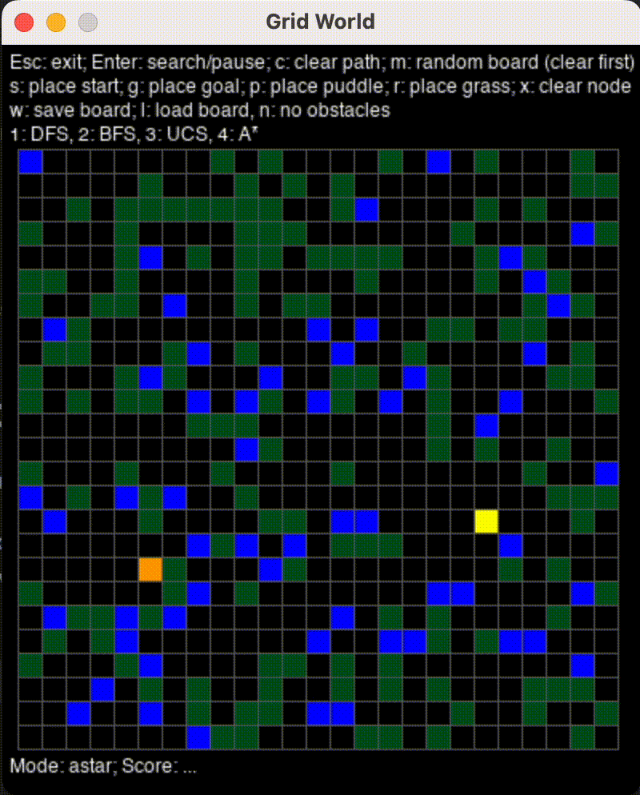
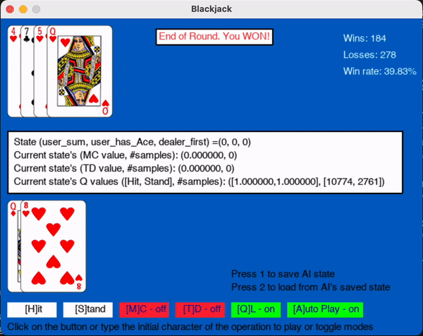
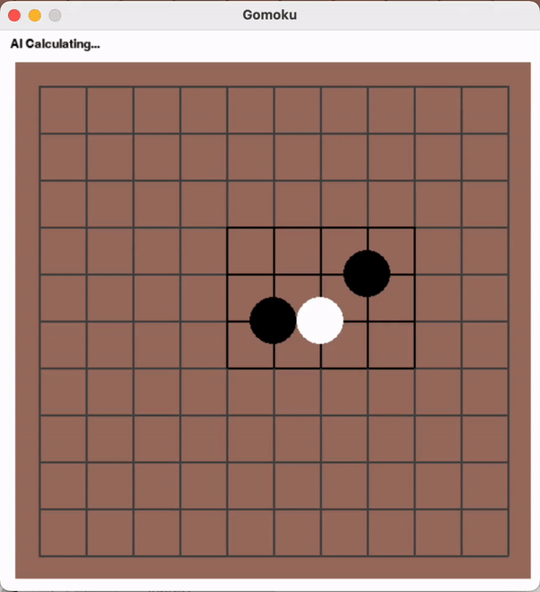
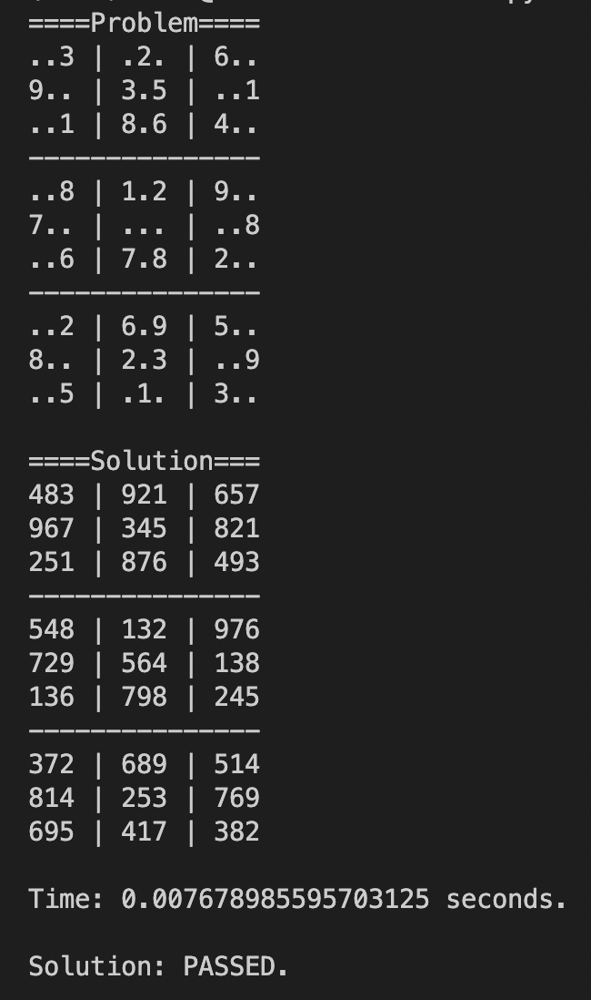

## Grid World

### Heuristic search

## 2048

### Adversarial search

Expectimax Search

Expectimax Search + Strategy

## Blackjack

### Reinforce Learning

## Gomoku

### Monte Carlo Tree Search

## Sudoku

### Constraint Solving

